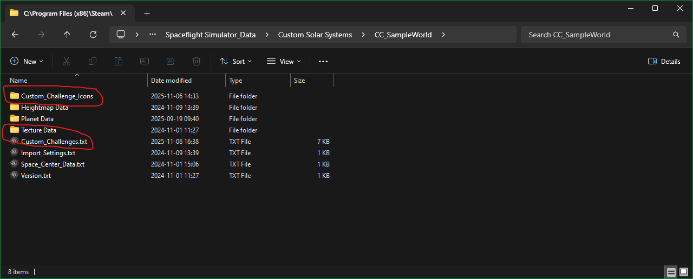

# Custom-Challenges-SFS1
The mod adds support for custom challenges to custom solar systems. N.B the challenge system in SFS is a bit buggy. It sometimes fails to detect when a condition is matched and sometimes forgets progress for a multi-step challenge. I've noted the bugs I've come across but you may need to test that a challenge works.

To specify custom challenges you need to add a Custom_Challenges.txt file and possibly a Custom_Challenge_Icons directory if you want to add your own challenge icons:



The file is a JSON array of challenge definitions each of which also contains a JSON array of steps of various types to be completed in the specified order. The is also a special step type - "Multi" - that contains an array of steps that may be completed in any order.

An example of a Custom_Challenges.txt. Note Custom_Challenges.txt in the CC_SampleWorld  file gives more examples:

```
[
    {
        "id":"NearEarth_Tour"
        ,"icon": "flyby.png"
        ,"priority":0
        ,"title":"Moon and asteroid flyby"
        ,"description":"Flyby both the Moon and the captured asteroid"
        ,"ownerName":"Earth"
        ,"challengeDifficulty": "Hard"
        ,"returnSafely": false
        ,"steps":
            [
                {
                    "stepType":"Multi"
                    ,"steps":
                        [
                            {
                                "planetName":"Moon"
                                ,"stepType":"Orbit"
                                ,"orbitType":"Esc"
                            }
                            ,{
                                "planetName":"Near_Earth_Asteroid"
                                ,"stepType":"Orbit"
                                ,"orbitType":"Esc"
                            }
                        ]
                }
            ]
    }
    ,{
        "id":"Moon_CloseFlyby"
        ,"icon": "flyby.png"
        ,"priority":1
        ,"title":"Moon flyby within [[2A]]"
        ,"description":"Flyby the moon within [[2A]]"
        ,"ownerName":"Moon"
        ,"challengeDifficulty": "Medium"
        ,"returnSafely": false
        ,"steps":
            [
                {
                    "planetName":"Moon"
                    ,"stepType":"Height"
                    ,"maxHeight": "2A"
                }
            ]
    }
    ,{
        "id":"Moon_Land_Heavy"
        ,"icon": "Land_One_Way"
        ,"priority":-1
        ,"title":"Heavy Payload To The Moon"
        ,"description":"Land at least 500 tonnes on the Moon"
        ,"ownerName":"Moon"
        ,"difficulty":"Normal"
        ,"challengeDifficulty": "Hard"
        ,"returnSafely": false
        ,"steps":
            [
                {
                    "planetName":"Moon"
                    ,"stepType":"Land"
                    ,"minMass": 500
                }
            ]
    }
```

Details for each field:

_Challenge_

"id" : {string value} (default "")
* The identifier for this challenge. Land and return challenges should start with "Land_" for consistency with standard challenges. N.B. is case-sensitive.
* If the same id as a vanilla challenge is supplied: this challenge will replace the vanilla challenge.
* If only the id field is supplied and it is same id as a vanilla challenge: the vanilla challenge will be removed (for this world only).
* vanilla challenge ids:
    * Liftoff_0
    * Reach_10km
    * Reach_30km
    * Reach_Downrange
    * Reach_Orbit
    * Orbit_High
    * Moon_Orbit
    * Moon_Tour
    * Asteroid_Crash
    * Mars_Tour
    * Venus_One_Way
    * Venus_Landing
    * Mercury_One_Way
    * Mercury_Landing
    * Land_{planet name} Where {planet name} is the name of a planet for other land and return safely challenges. N.B. Only these challenges are automatically created for custom systems by SFS.

"icon" : {string value} (default "")
* indicates which of the icons should be used, omit or leave blank to indicate that an existing challenges should be deleted. If suffixed with '.png' will load a file from Custom_Challenge_Icons/ . Otherwise a standard SFS Icon will be used, one of:
*  "firstFlight", "10Km", "30Km", "50Km", "Downrange", "Reach_Orbit", "Orbit_High", "Capture", "Tour", "Crash","Land_One_Way", "Land_Return"

"difficulty" : {string value} (default "all")
*  The difficulty mode that this challenge is enabled for: "all", "normal", "hard", "realistic"

"priority" : {int value} (default 0)
* indicates how to sort this challenge, is a small signed integer, higher numbers appear at the top of the list.

"title" : {string value} (default "")
* The title to be used, N.B. not automatically translated (the in-game ones are translated). A sub-string like \[\[3A\]\] or \[\[0.5R:Moon\]\] , specifying planet-relative units will be replaced with a value in m, km, Mm, Gm, Tm or ly. The planet defaults to the one in ownerName

"description" : {string value} (default "")
* The description to be used, N.B. not automatically translated (the in-game ones are translated).

"ownerName" : {string value} (default "")
* The name of the planet that is the 'owner' of this challenge. This specifies the planet the challenge appears under

"challengeDifficulty" : {string value} (default "")
* The challenge difficulty indicator to be used (will be translated). Possible values: Easy, Medium, Hard, Extreme

"returnSafely" : {bool value} (default false)
* Indicates that return safely is needed. If true, and the custom system includes a planet called 'Earth', a land on Earth step will be added as the end.  It also seems to indicate that the completed challenge should appears in the challenge log when the rocket is recovered and may indicate that the challenge should only be recorded once recovered. You will have to experiment with this. If false the challenge completed message appears as soon as the criteria at met, and the challanges completiong is recorded at the same time.

"steps" : {array of step values} (default null)
* The steps needed to complete this challenge in the order they need to be accomplished in. N.B. all the pre-defined challenges only specify one step - the 'Tour' challenges use special 'multi step' types that indicates they can be done in any order - these are all buggy. "returnSafely" is used to indicate a 'Land on Earth' step is expected at the end. I haven't spotted SFS forgetting the progress for multiple (sequential) steps, but the vanilla challenges have a maximum of two steps with the second being 'Land on Earth'.

_Step_

"planetName" : {string value} (default "")
* The name of the planet where this step is to be accomplished, not used for stepType="Multi" or "Any"

"stepType" : {string value} (default "")
* The type of step. Possible values:
* "Multi" - all of the specified steps in any order
    * note buggy - SFS seems to forget the progress in some cases.
    * does not support the "Impact" step type as a sub-step.
    
* "Any" - any one of the specified steps
    * does not support the "Impact" step type as a sub-step.

* "Any_Landmarks" - a number of landmarks in any order
    * note buggy - SFS seems to forget the progress in some cases

* "Downrange" - used if landed a minimum distance from the current(?) launch pad . Effect on planets without a current launchpad is unclear.
* "Height" - used for altitude reached.
* "Impact" - impact at a minumum velocity, unclear how this works
* "Land" - land on this planet
* "Orbit" - orbit this planet using SFS orbit classifications
* "CustomOrbit" - orbit this planet with the specified orbital parameters. N.B. this does not appear to work for the Sun for some reason - will need expermentation.

"steps" : {array of step values} (default null)
* Used for stepType="Multi" or "Any", the steps thar apply to this challenge
* "Multi":the list of steps that all need to be accomplished (in any order)
* "Any":the list of steps, one of which must be accomplished

"count" : {int value} (default 0)
* only used for stepType="Any_Landmarks", the minimum number of landmarks that need to be landed on.

"downrange" : {string value with units} (default "")
* Only used for stepType="Downrange", the mimimum distance from the launch site

"hasEngines" : {bool value} (default null)
* Used for stepType="Height","Land","Orbit","CustomOrbit", "Any_Landmarks". Test for the presence of engines or boosters.
    * If true, rocket must have engines or boosters. (Probably not useful)
    * If false, rocket must not have engines or boosters. This can be used to test for a released payload. N.B. the payload needs to be the current rocket to detect this.
    * If omitted or null is not checked.

"impactVelocity" : {int value} (default 0)
* Only used for stepType="Impact". The mimimum velocity at impact in m/s.

"minHeight" : {string value with units} (default "")
* Only used for stepType="Height". The minimum altitude to be reached (useful for launches)

"maxHeight" : {string value with units} (default "")
* Only used for stepType="Height". The maximum altitude to be reached (useful for flybys)

"minMass" : {double value} (default double.NaN)
* Used for stepType="Height","Land","Orbit","CustomOrbit", "Any_Landmarks". The minimum rocket mass in tonnes.
    * If already in orbit (or landed) docking additional rockets can meet the challenge.
    * For "Any_Landmarks" the rocket mass is checked for ***all*** landings

"maxMass" : {double value} (default double.NaN)
* Used for stepType="Height","Land","Orbit","CustomOrbit", "Any_Landmarks". The maximum rocket mass in tonnes.
    * With "Height" and a low value can be used to specify a maximum launch mass.
    * For "Any_Landmarks" the rocket mass is checked for ***all*** landings

"orbitType" : {string value} (default "")
* Only used for stepType="Orbit". The type of orbit the needs to be reached. Note, each condition is checked in the following order and the first matching one is counted. Possible values:
*  "None" - landed - not sure if this is usefull
*  "Esc" - apoapsis>SOI - could also be used to detect a flyby
*  "Sub" - suborbital, periapsis below surface
*  "High" - periapsis > 1.5 radius above surface
*  "Trans"- apoapsis > 0.5 radius above surface
*  "Low"  - anything else

"maxApoapsis" : {string value with units} (default "")
* Only used for stepType="CustomOrbit".The maximum apoapsis.

"maxEcc" : {double value} (default double.NaN)
* Only used for stepType="CustomOrbit".The maximum eccentricity.

"maxPeriapsis" : {string value with units} (default "")
* Only used for stepType="CustomOrbit".The maximum periapsis.

"maxSma" : {string value with units} (default "")
* Only used for stepType="CustomOrbit".The maximum semi-major axis.

"minApoapsis" : {string value with units} (default "")
* Only used for stepType="CustomOrbit".The minimum apoapsis.

"minEcc" : {double value} (default double.NaN - indicates ignore this)
* Only used for stepType="CustomOrbit".The minimum eccentricity. Does not seem to be able to detect eccentricities >=1 .

"minPeriapsis" : {string value with units} (default "")
* Only used for stepType="CustomOrbit".The minimum periapsis.

"minSma" : {string value with units} (default "")
* Only used for stepType="CustomOrbit".The minimum semi-major axis.

{string value with units> (used for downrange/height/periapsis/apoapsis/sma values), if the last character is a digit the value is the altitude/distance in meters, otherwise it should be one of:
* "k" - for km altitude or distance
* "m" - for Mm altitude or distance
* "g" - for Gm altitude or distance
* "t" - for Tm altitude or distance
* "l" - for light-years altitude or distance

planet-relative units:
* "a" - for atmosphere height altitude or distance (if the planet has no atmosphere will use a maximum of max terrain height and timewarp height)
* "r" - for planetary radius altitude or distance
* "s" - SOI multiple distance from center (values should be <1) - not useful for distances?
